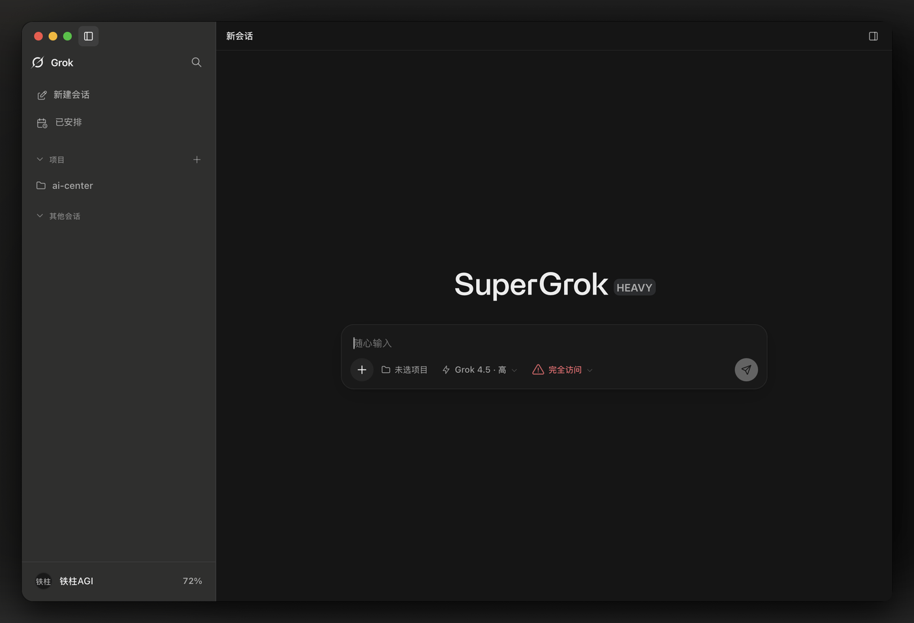
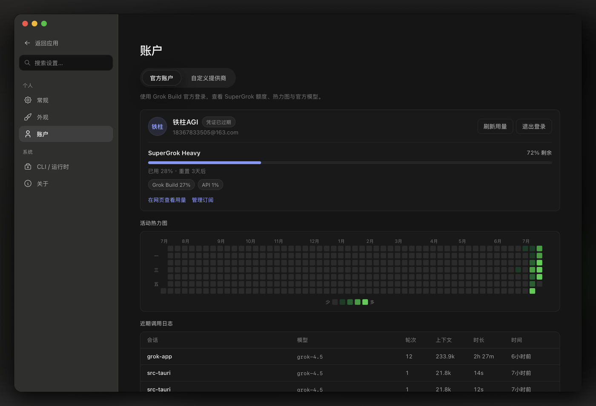
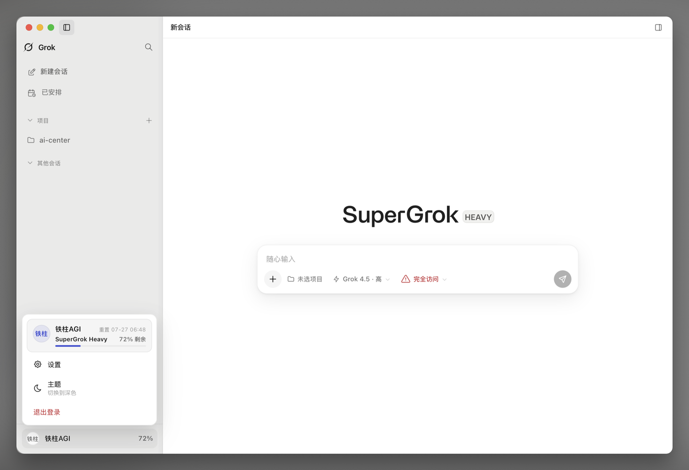
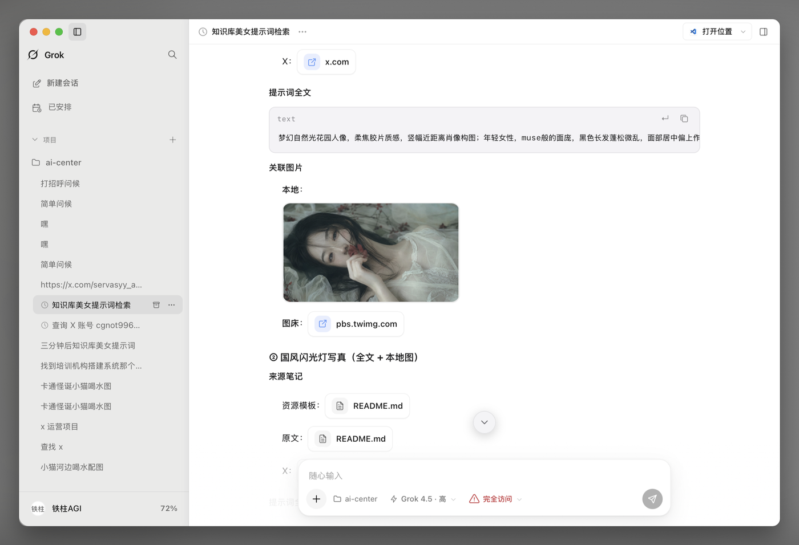

<p align="center">
  
</p>

<h1 align="center">Grok App</h1>

<p align="center"><strong>本机 Grok Build 的桌面指挥台</strong></p>
<p align="center"><em>Sessions, projects, media, automations — for the real <code>grok</code> CLI</em></p>

<p align="center">
  <a href="./README.md">English</a> ·
  <a href="./README_ZH.md">中文</a>
</p>

<p align="center">
  <a href="LICENSE"></a>
  <a href="https://github.com/RongleCat/grok-app/stargazers"></a>
  
  
  
</p>

<p align="center">
  <a href="https://x.com/cgnot996"></a>
  
</p>

<p align="center">
  <strong>关注作者 · 进交流群</strong><br/>
  <a href="https://x.com/cgnot996"><strong>X / Twitter → 铁柱AGI @cgnot996</strong></a><br/>
  微信公众号搜索 <strong>「铁柱AGI」</strong> · 扫右侧码加入用户交流群
</p>

<p align="center">
  
  &nbsp;&nbsp;
  
</p>
<p align="center">
  <sub>左：公众号 · 右：<strong>微信交流群</strong></sub>
</p>

<p align="center">
  仓库 ·
  <a href="https://github.com/RongleCat/grok-app">RongleCat/grok-app</a>
</p>

---

> [!NOTE]
> ## 说明
>
> **Grok App 不是 xAI 官方产品。** 它把本机 [Grok Build](https://x.ai) CLI（`grok agent stdio`）收成桌面工作台：会话、项目、权限、媒体预览与已安排任务。
>
> 真 Agent 能力依赖本机已安装并可登录的 **Grok Build CLI**。没有 CLI 时可用首次向导安装，或开发态 `GROK_APP_ACP=mock` 做 UI 联调。

---

## 目录

1. [简介](#简介)
2. [功能特性](#功能特性)
3. [界面预览](#界面预览)
4. [安装与使用](#安装与使用)
5. [macOS 无法打开 / 提示已损坏](#macos-无法打开--提示已损坏)
6. [配置目录](#配置目录)
7. [开发与构建](#开发与构建)
8. [文档与贡献](#文档与贡献)
9. [贡献者](#贡献者)
10. [关注作者](#关注作者)

---

## 简介

在终端里跑 `grok` 很强，但日常工作台还缺一块：多项目、多会话、权限条、富媒体预览、定时任务、中英文界面。

**Grok App** 解决的是「指挥台」问题：

1. 安装 App，准备好 Grok Build CLI  
2. 添加项目 / 新建会话  
3. 连接 Agent，用 Ask 或 YOLO 发消息  
4. 预览产物、安排自动化、在设置里管账号与中转  

技术栈：**Tauri 2 + Rust · React + TypeScript + Vite · Tailwind CSS**

---

## 功能特性

| 类别 | 说明 |
|------|------|
| **真 Build 会话** | 默认 `grok agent stdio`（ACP）；Host 独占会话 FSM；可选远程 ACP |
| **项目与会话** | 多项目信任目录、侧栏虚拟列表、归档 / orphan、分叉与回退；**shared 模式导入 CLI 会话** |
| **多会话流式** | 切换聊天时后台继续流式 / 权限；并发上限与闲置回收 |
| **Git 工作树** | 项目 chip 列出 linked worktree，一键切换会话 cwd（非 git 不展示） |
| **权限** | 默认 Ask；Allow once / session / Deny；YOLO；**按项目**默认权限阶梯 |
| **Plan / Goal** | 顶部执行进度；资源面板 Markdown 审阅与步骤；Goal 入口 |
| **斜杠 · 扩展** | 斜杠面板、Skills；设置 → 扩展管理 MCP / Plugins |
| **Composer** | 忙时后续消息队列；粘贴截图附件；上下文用量芯片 |
| **媒体与文件** | 图 / 视频 / PDF / Office / 代码预览；资源窗可**编辑保存**文本；Changes（会话 diff + 工作区 git） |
| **Agent 运行时** | 卡顿取消；结构化错误卡；会话**诊断包**导出；工具/权限未完不提前「就绪」 |
| **自动化** | 已安排任务列表；对话里自然语言创建（静默 fence，不展示 JSON） |
| **账号与额度** | 多账号切换、官方登录、SuperGrok 额度与热力图、自定义中转本地用量 |
| **自定义中转** | 独立 `GROK_HOME` agent 配置，避免污染默认 `~/.grok` |
| **安全** | API Key 可选系统钥匙串（默认 `secrets.json` 0600）；store 写锁；应用内确认框 |
| **i18n** | 简体中文 / 繁體中文 / English 与托盘 |
| **跨平台打包** | macOS ARM / Intel · Windows x64（安装版 + 绿色版）· Linux x64（AppImage / deb / rpm） |

---

## 界面预览

> 截图来自当前开发版（macOS）。

| 工作台 · SuperGrok | 账户与额度 |
|:---:|:---:|
|  |  |

| 浅色主题 | 会话与媒体 |
|:---:|:---:|
|  |  |

---

## 安装与使用

### 1. 下载

从 [Releases](https://github.com/RongleCat/grok-app/releases) 下载对应平台安装包：

| 平台 | 文件 |
|------|------|
| macOS Apple Silicon | `Grok_*_aarch64.dmg` |
| macOS Intel | `Grok_*_x64.dmg` |
| Windows x64 | `*-setup.exe` 安装版 + `*-portable.zip` 绿色版 |
| Linux x64 | `AppImage` / `.deb` / `.rpm` |

安装包产品名为 **Grok**（与窗口标题一致）。

**Arch / Manjaro / EndeavourOS 等：** 优先下载 **AppImage**（`chmod +x` 后运行），不依赖发行版打包格式。`.deb` 可用 `debtap` 等转换，但官方 CI 不单独发布 AUR 包。

### 2. 首次使用

1. 启动 App → **Setup 向导** 确认 CLI 已安装（可一键多镜像安装）  
2. （可选）登录官方账号 / 填 API Key / 配置自定义中转；可跳过  
3. **添加项目** → 选择并信任文件夹  
4. **连接 Agent** → Ready 后发消息  
5. 权限条默认 **Ask**；需要无人值守时再开 YOLO  

### 3. 依赖

- 本机 **Grok Build CLI**（`grok`），常见路径：`~/.grok/bin/grok` 或 PATH  
- Windows：`%USERPROFILE%\.grok\bin\grok.exe` 或 PATH  

---

## macOS 无法打开 / 提示已损坏

当前 Release **未做 Apple 公证**（需付费开发者账号）。从 GitHub 下载后，Gatekeeper 可能提示「已损坏」「无法验证开发者」等，属预期行为。

**推荐处理：**

```bash
# 将 App 拖到「应用程序」后执行
xattr -cr /Applications/Grok.app
open /Applications/Grok.app
```

**其他方式：**

- Finder 中 **右键** App → **打开** → 再次确认打开  
- **系统设置 → 隐私与安全性** → 对拦截项点 **仍要打开**  

请仅从本仓库官方 [Releases](https://github.com/RongleCat/grok-app/releases) 下载。

---

## 配置目录

默认数据根（可用环境变量 **`GROK_APP_HOME`** 覆盖）：

| 平台 | 典型路径 |
|------|----------|
| macOS | `~/Library/Application Support/com.grokapp.grok-app/` |
| Windows | `%APPDATA%\grokapp\grok-app\` |
| 回退 | `~/.grok-app/` |

```text
<app-data>/
  projects.json
  sessions_index.json
  settings.json
  secrets.json          # 元数据（+ API key 回退）；密钥优先系统钥匙串
  automations.json
  projects/
  sessions/
  logs/
  agent-home/           # 独立模式 GROK_HOME（providers / config.toml）
```

API 密钥优先写入系统钥匙串（macOS Keychain / Windows Credential Manager /
Linux Secret Service）；不可用时回退到 `secrets.json`（mode `0600`）。请勿提交密钥。

Grok Build 自身配置仍在 **`~/.grok`**（CLI 登录、`auth.json` 等）。  
**shared** 会话模式可与 CLI 共用 `~/.grok`；**independent** 模式使用 `agent-home/`。

---

## 开发与构建

```bash
# 依赖：Node 22+、pnpm 9、Rust stable、Xcode CLT (macOS)
pnpm install

# 开发（前端 + Tauri，默认真 CLI）
pnpm dev

# 仅前端
pnpm dev:ui

# 无 CLI 的 mock 联调
GROK_APP_ACP=mock pnpm dev

# 检查
pnpm typecheck && pnpm test
cd src-tauri && cargo test

# 生产构建
pnpm build
```

交叉编译、发版与可选签名见 [docs/BUILD.md](./docs/BUILD.md)。

发版（需先写好 `CHANGELOG.md` 对应章节）：

```bash
./scripts/release-tag.sh 0.1.1          # 本地 tag
./scripts/release-tag.sh 0.1.1 --push   # 推送后触发 CI 打安装包
```

---

## 文档与贡献

| 对象 | 入口 |
|------|------|
| AI Agent / 产品规则 | [`docs/llm-wiki/`](./docs/llm-wiki/) |
| 构建与发布 | [docs/BUILD.md](./docs/BUILD.md) |
| 更新日志 | [CHANGELOG.md](./CHANGELOG.md) |
| 贡献指南 | [CONTRIBUTING.md](./CONTRIBUTING.md) |
| 行为准则 | [CODE_OF_CONDUCT.md](./CODE_OF_CONDUCT.md) |
| 安全披露 | [SECURITY.md](./SECURITY.md) |

欢迎 Issue 与 PR。

## 贡献者

<!-- CONTRIBUTORS:START -->
感谢所有为 Grok App 做出贡献的人！以下为 GitHub 仓库全部人类贡献者（按 commits 降序，2026-07-29 更新）。

<p align="center">
  <a href="https://github.com/RongleCat" title="RongleCat"></a>
  <a href="https://github.com/sonnemusk" title="sonnemusk"></a>
  <a href="https://github.com/jason920612" title="jason920612"></a>
  <a href="https://github.com/1parado" title="1parado"></a>
  <a href="https://github.com/lunar-me" title="lunar-me"></a>
  <a href="https://github.com/Sdefendre" title="Sdefendre"></a>
  <a href="https://github.com/shiaho777" title="shiaho777"></a>
  <a href="https://github.com/yuhaouno" title="yuhaouno"></a>
  <a href="https://github.com/2530185073" title="2530185073"></a>
  <a href="https://github.com/fannnzhang" title="fannnzhang"></a>
  <a href="https://github.com/jchacker5" title="jchacker5"></a>
  <a href="https://github.com/tisrop" title="tisrop"></a>
</p>

[完整贡献图 →](https://github.com/RongleCat/grok-app/graphs/contributors)
<!-- CONTRIBUTORS:END -->

## License

[MIT](./LICENSE) © RongleCat

---

## 关注作者

项目更新、用法拆解与 AI 实战内容，优先看作者主页；用户互助可进微信群：

| 渠道 | 入口 |
|------|------|
| **X / Twitter** | [铁柱AGI @cgnot996](https://x.com/cgnot996) ← 强烈推荐关注 |
| **微信公众号** | 搜索 **「铁柱AGI」**，或扫下方**左侧**码 / 搜一搜卡片 |
| **微信交流群** | 扫下方**右侧**二维码，添加微信进入交流群 |

<p align="center">
  
  &nbsp;&nbsp;
  
</p>
<p align="center">
  <sub>左：公众号 · 右：交流群</sub>
</p>

<p align="center">
  如果 Grok App 对你有帮助，请给仓库点个 Star，并在
  <a href="https://x.com/cgnot996"><strong>X @cgnot996</strong></a>、
  微信公众号 <strong>铁柱AGI</strong> 关注作者，欢迎扫码进群交流 🙏
</p>
